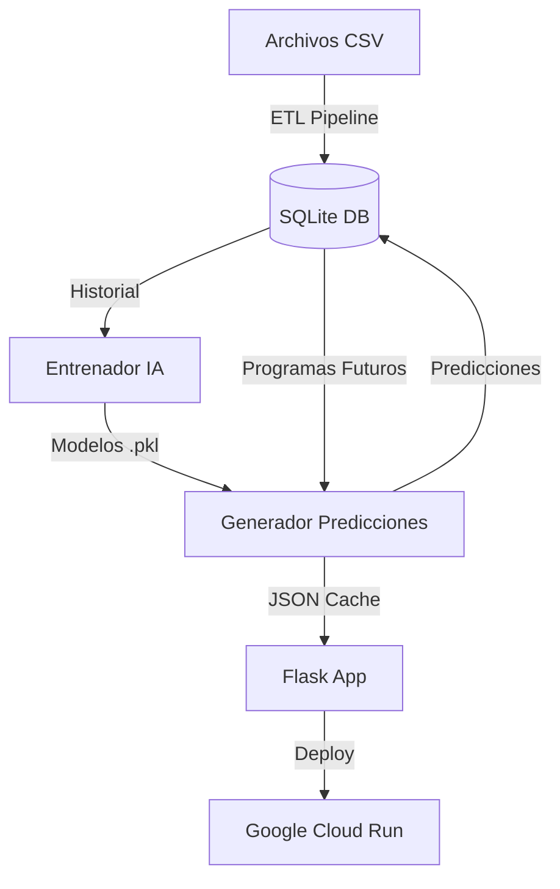

# Documentación Técnica del Sistema de Hípica Inteligente

## Visión General
El sistema de **Hípica Inteligente** es una plataforma end-to-end que ingesta datos de carreras hípicas (programas y resultados), entrena modelos de Machine Learning para predecir ganadores, y despliega una aplicación web visual en la nube.

## Arquitectura del Sistema



## 1. Subsistema de ETL (Carga de Datos)
Ubicación: `src/etl/etl_pipeline.py`

El ETL es responsable de leer los archivos CSV crudos, limpiar los datos, normalizarlos y cargarlos en la base de datos relacional.

### Características Clave
*   **Detección Automática**: Escanea la carpeta `exports/` en busca de archivos nuevos.
*   **Tracking de Archivos**: Mantiene un registro en la tabla `archivos_procesados` para evitar duplicados.
*   **Normalización Inteligente**: Mapea columnas variables automáticamente.
    *   Ejemplo: Acepta tanto `Puesto` (Hipódromo Chile) como `Lugar` (Club Hípico) y los convierte a `posicion`.
*   **Persistencia Segura**: Utiliza `INSERT OR REPLACE` para actualizar registros existentes sin borrar la historia (bug corregido en v2.1).

### Convención de Archivos
El sistema espera los siguientes prefijos en la carpeta `exports/`:
*   `PROGRAMA_...`: Información de carreras futuras (caballos, jinetes, distancias).
*   `RESULTADOS_...` o `RESULTADO_...`: Resultados históricos (quién ganó, dividendos).

## 2. Subsistema de Inteligencia Artificial
Ubicación: `src/models/train_v2.py` y `src/models/data_manager.py`

### Modelo
*   **Algoritmo**: `HistGradientBoostingClassifier` (Scikit-Learn).
*   **Target**: Clasificación Binaria (Ganador vs No Ganador) o Ranking.
*   **Features**:
    *   Historial reciente del caballo (posiciones previas).
    *   Rendimiento del jinete y stud.
    *   Factores de pista (distancia, tipo de superficie).

### Blending (Híbrido)
El sistema utiliza una estrategia híbrida para la puntuación final (`puntaje_ia`):
*   70% Score del Modelo ML (Probabilidad Matemática).
*   30% Heurística Experta (Reglas de negocio, debutantes, rachas).

## 3. Sistema de Sincronización (Orquestador)
Ubicación: `sync_system.py`

Es el cerebro operativo que coordina todo el flujo.

### Uso desde Línea de Comandos
```bash
# Modo Estándar: Procesa solo archivos nuevos
python sync_system.py

# Modo Forzado: Reprocesa TODO y reentrena modelos (Útil para corregir errores)
python sync_system.py --force

# Modo Local: Ejecuta sin desplegar a la nube
python sync_system.py --no-deploy
```

### Funciones Críticas
*   `_safe_int(val)`: Protege la base de datos contra corrupción de tipos (binarios/BLOBs).
*   `precalculate_predictions()`: Genera las predicciones para todas las carreras activas y las guarda en BD y JSON.

## 4. Despliegue e Infraestructura
Ubicación: `app.py`, `Dockerfile`

*   **Aplicación Web**: Flask (Python).
*   **Base de Datos**: SQLite (alojada en contenedor, se regenera/actualiza con `sync_system`).
*   **Nube**: Google Cloud Run (Containerless).
*   **Seguridad**: API Keys manejadas vía variables de entorno (`GEMINI_API_KEY`).

## Preguntas Frecuentes (FAQ)

### ¿Debo normalizar "Lugar" vs "Puesto" en los CSV?
**NO.** El ETL ya lo hace por ti.
*   Si el CSV trae `Puesto` -> Se carga como `posicion`.
*   Si el CSV trae `Lugar` -> Se carga como `posicion`.
Puedes cargar archivos de diferentes fuentes sin editarlos manualmente.

### ¿Por qué mi predicción dice 0% de acierto?
Asegúrate de haber cargado el archivo de **RESULTADOS** correspondiente a la fecha de las predicciones. Sin resultados reales, el sistema no puede verificar si acertó.
Usa `python sync_system.py --force` después de cargar resultados atrasados.
